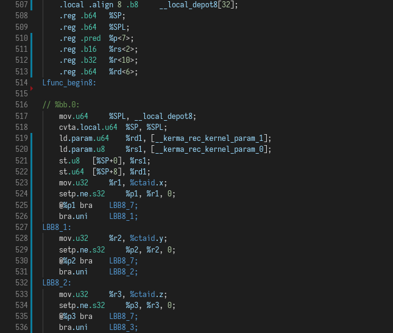

# About

This is a Visual Studio Code extension providing syntax highlighting for [Nvidia PTX](https://docs.nvidia.com/cuda/parallel-thread-execution/index.html).

## Features

- Basic Support for PTX Syntax
- All versions up to 7.1 supported

## Screenshot

- Theme: Dark+ (default)

  

## Known Issues

Currently lacking preprocessor support. This will be added in a future version.

## Release Notes

### 1.0.0

Initial Release